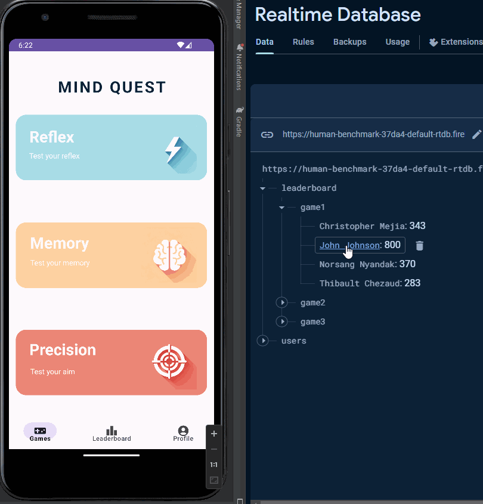
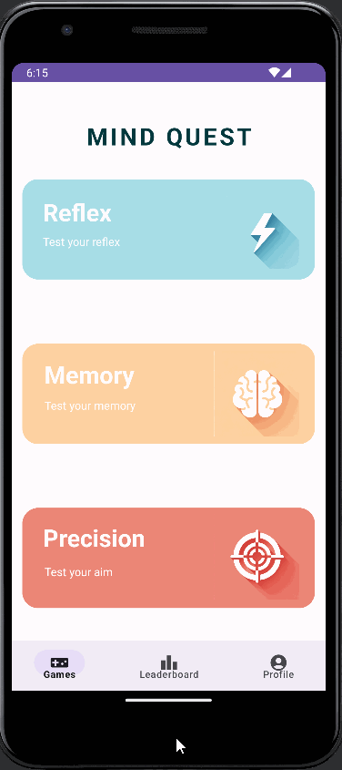
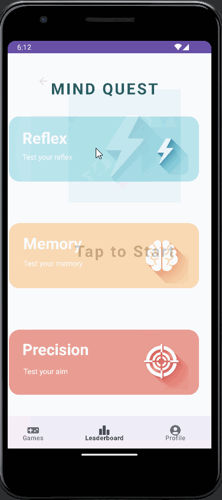
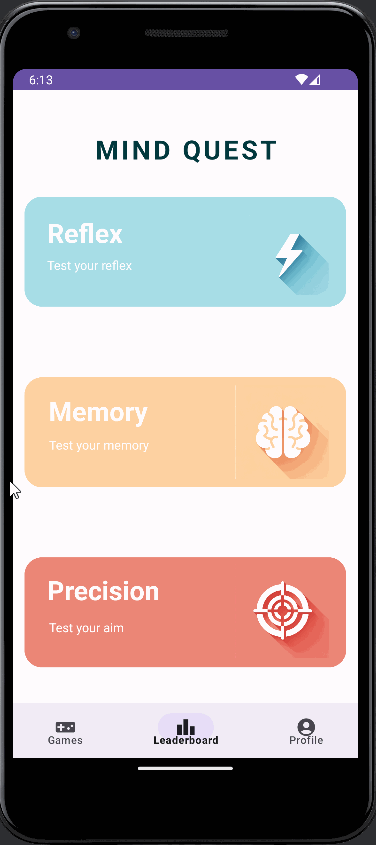

# MindQuest
## MindQuest is a "human benchmark" Android app, with minigames that test the user's reaction time, memory, and hand-eye coordination. MindQuest uses a FireBase backend, allowing users to securely login via Gmail and dynamically save and store their best scores. A Realtime Database-based leaderboard stores every logged-in user's best scores in every game.

## Outline

### Realtime Database

MindQuest uses FireBase's Realtime Database implementation to dynamically save and display logged-in users' high scores on a leaderboard.

### Google Login

MindQuest uses FireBase's Google Authentication API, allowing users to login with their Gmail account and save their scores.

### Reflex Game

This is the simplest game. It prompts the user to tap the screen once the screen turns green. The delay to turn the screen green is a random value, so the user must depend solely on their reaction time to properly react. If the user taps too soon, the delay to turn green resets.

### Memory Game

This game randomly generates a sequence of tile-taps. The user has to remember progressively longer sequences of tile-taps. Each level represents one more tap in the sequence.

### Precision Game

This game randomly places a sequence of 30 small targets on the screen, which the user has to tap as quickly as possible.

## Development Progression
This section visually outlines the progress our team made on MindQuest, starting with a static wireframe and finishing with a functioning Android demo.

### Initial Wireframe

### Interactive Wireframe

### GitHub Project board

### Issue cards

### Early Demos

